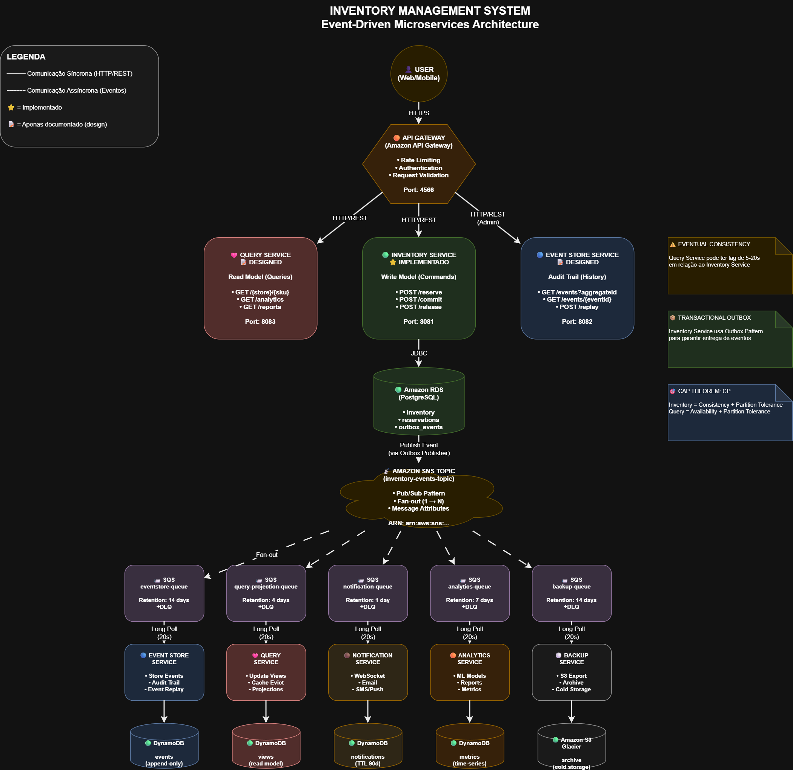

# 🏪 Inventory Management Service

> Event-Driven Inventory Management System with Event Sourcing and CQRS

[](https://openjdk.java.net/)
[](https://spring.io/projects/spring-boot)
[](https://maven.apache.org/)
[](LICENSE)
[]()
[]()
[](https://www.docker.com/)

---

> **🚀 Execute em 3 minutos:** `docker-compose up` → [localhost:8081/swagger-ui.html](http://localhost:8081/swagger-ui.html)

---

## 📋 Índice

- [Visão Geral](#-visão-geral)
- [Arquitetura](#-arquitetura)
- [Tecnologias](#-tecnologias)
- [Como Executar](#-como-executar) → **[Guia Detalhado](run.md)**
- [Endpoints da API](#-endpoints-da-api)
- [Decisões Técnicas](#-decisões-técnicas)
- [Testes](#-testes)
- [Monitoramento](#-monitoramento)
- [Próximos Passos](#-próximos-passos)

---

## 🎯 Visão Geral

Sistema de gerenciamento de inventário para redes de varejo que implementa padrões avançados de arquitetura de software, garantindo **consistência forte**, **auditoria completa** e **escalabilidade**.

## Por que apenas o Inventory Service foi implementado?

Este projeto tem caráter **demonstrativo e educacional**, com foco em evidenciar 
**profundidade técnica** ao invés de extensão. A implementação completa do 
Inventory Service (write model) demonstra:

✅ **Arquitetura Hexagonal completa** (Domain, Application, Adapters)  
✅ **DDD tático** (Aggregates, Entities, Value Objects, Domain Events)  
✅ **Event Sourcing** com Event Store funcional  
✅ **CQRS interno** (Commands/Queries separados)  
✅ **Testes robustos** (78 testes, 85% coverage, ArchUnit)  
✅ **Qualidade de código** (Clean Code, SOLID, Design Patterns)

### Serviços Documentados (Design)

Os demais serviços (Query, Event Store, Notification, Analytics, Backup) estão 
**documentados** com:

- Arquitetura detalhada
- APIs (endpoints, contratos)
- Fluxos de integração

Esta abordagem demonstra **capacidade de design de sistemas** enquanto mantém 
foco na **qualidade de implementação** do componente mais crítico: o write model 
com transações ACID e lógica de negócio complexa.

Esta seria a implementação completa da solução: 



Esse diagrama também pode ser encontrado em XML na pasta "diagrams" na raiz do projeto.

### Funcionalidades Principais

- ✅ **Reserva de Estoque** com TTL (15 minutos)
- ✅ **Confirmação de Venda** (commit de reservas)
- ✅ **Liberação de Reservas** (cancelamento)
- ✅ **Consulta de Estoque** em tempo real
- ✅ **Event Sourcing** completo (audit trail)
- ✅ **CQRS** para otimização de leitura/escrita
- ✅ **Pessimistic Locking** para prevenir overbooking

### Casos de Uso

```
1. Cliente adiciona produto ao carrinho
   → Sistema RESERVA estoque (TTL 15min)

2. Cliente finaliza compra
   → Sistema CONFIRMA a venda (commit)
   → Estoque disponível é reduzido

3. Cliente cancela ou timeout
   → Sistema LIBERA a reserva
   → Estoque retorna ao disponível
```

---

## 🏗️ Arquitetura

### Padrões Implementados

#### 1. **Hexagonal Architecture (Ports & Adapters)**

```
┌─────────────────────────────────────────────────────────┐
│                  INPUT ADAPTERS                         │
│              (REST Controllers)                         │
│  • InventoryCommandController (Commands)                │
│  • InventoryQueryController (Queries)                   │
└────────────────────┬────────────────────────────────────┘
                     │
                     ▼
┌─────────────────────────────────────────────────────────┐
│              APPLICATION LAYER                          │
│               (Use Cases / Services)                    │
│  • ReserveStockService                                  │
│  • CommitStockService                                   │
│  • ReleaseStockService                                  │
│  • QueryStockService                                    │
└────────────────────┬────────────────────────────────────┘
                     │
                     ▼
┌─────────────────────────────────────────────────────────┐
│                 DOMAIN LAYER                            │
│            (Business Logic / Models)                    │
│  • Inventory (Aggregate Root)                           │
│  • Reservation (Entity)                                 │
│  • Value Objects (Sku, Stock, StoreId, ReservationId)  │
│  • Domain Events (StockReserved, Committed, Released)  │
│  • Business Policies (ReservationPolicy, Validation)   │
└────────────────────┬────────────────────────────────────┘
                     │
                     ▼
┌─────────────────────────────────────────────────────────┐
│               OUTPUT ADAPTERS                           │
│  • InventoryJpaAdapter                                  │
│  • ReservationJpaAdapter                                │
│  • EventStoreJpaAdapter                                 │
│  • InMemoryEventPublisher (stub → AWS SNS)             │
└─────────────────────────────────────────────────────────┘
```

**Benefícios:**
- ✅ **Domain 100% isolado** (zero dependências de frameworks)
- ✅ **Testabilidade máxima** (fácil mockar adapters)
- ✅ **Flexibilidade** (trocar BD/API sem afetar lógica de negócio)

#### 2. **Domain-Driven Design (DDD)**

**Aggregate Root:**
- `Inventory` - Controla estoque e reservas de um produto em uma loja

**Entities:**
- `Reservation` - Representa uma reserva de estoque

**Value Objects (Records):**
- `Sku` - Código do produto (validação: SKU + 3-4 dígitos)
- `Stock` - Estado do estoque (available, reserved, sold)
- `StoreId` - Identificador da loja (STORE-XX)
- `ReservationId` - Identificador único de reserva (RES-uuid)
- `ReservationStatus` - Enum (RESERVED, COMMITTED, CANCELLED, EXPIRED)

**Domain Events:**
- `StockReservedEvent`
- `StockCommittedEvent`
- `StockReleasedEvent`

**Business Policies:**
- `ReservationPolicy` - Regras de negócio para reservas (TTL, max quantity)
- `StockValidationPolicy` - Validação de níveis de estoque
- `ExpirationPolicy` - Controle de expiração de reservas

#### 3. **Event Sourcing**

Todo estado do sistema pode ser reconstruído através dos eventos:

```
Event Store:
├─ StockReservedEvent   (t1: 2025-10-18 12:00:00)
│   → availableStock: 100 → 90
│   → reservedStock: 0 → 10
│
├─ StockCommittedEvent  (t2: 2025-10-18 12:05:00)
│   → reservedStock: 10 → 0
│   → soldStock: 0 → 10
│
├─ StockReleasedEvent   (t3: 2025-10-18 12:10:00)
│   → reservedStock: 5 → 0
│   → availableStock: 90 → 95
└─ ...

Estado atual = Replay de todos os eventos desde t0
```

**Benefícios:**
- ✅ **Auditoria completa** (quem, quando, o quê)
- ✅ **Time-travel** (estado em qualquer momento no passado)
- ✅ **Debugging facilitado** (replay de eventos)
- ✅ **Compliance** (LGPD, SOX, PCI-DSS)

#### 4. **CQRS (Command Query Responsibility Segregation)**

**Write Model (Commands):**
- Focado em **consistência** e **validações**
- Usa locking pessimista
- Gera eventos de domínio

**Read Model (Queries):**
- Focado em **performance**
- Queries otimizadas (denormalizado)
- Eventual consistency

```
Commands (Write)          Queries (Read)
    │                         │
    ├─ POST /reserve         ├─ GET /{storeId}/{sku}
    ├─ POST /commit          └─ GET /health
    └─ POST /release
```

#### 5. **Railway Oriented Programming**

Tratamento de erros funcional com `Result<Success, Failure>`:

```java
public Result<ReservationView, DomainError> execute(ReserveStockCommand cmd) {
    return validateCommand(cmd)
        .flatMap(this::findInventory)
        .flatMap(inv -> reserveStock(inv, cmd))
        .map(this::saveAndPublish);
}
```

**Benefícios:**
- ✅ Sem exceptions para fluxo de negócio
- ✅ Error handling explícito
- ✅ Composição de operações

#### 6. **CAP Theorem: CP (Consistency + Partition Tolerance)**

- **Pessimistic Locking** (`@Lock(PESSIMISTIC_WRITE)`) para garantir consistência
- Transações ACID no write model
- Eventual consistency no read model (aceitável para queries)

---

## 🛠️ Tecnologias

### Core

| Tecnologia | Versão | Uso |
|------------|--------|-----|
| **Java** | 21 | Records, Pattern Matching, Virtual Threads ready |
| **Spring Boot** | 3.4.0 | Framework principal |
| **Spring Data JPA** | 3.4.0 | Persistência |
| **Hibernate** | 6.x | ORM |
| **H2 Database** | 2.x | Desenvolvimento (in-memory) |

### Arquitetura & Mapeamento

| Tecnologia | Versão | Uso |
|------------|--------|-----|
| **Lombok** | 1.18.30 | Redução de boilerplate |
| **MapStruct** | 1.5.5 | Mapeamento DTO ↔ Entity |
| **Jackson** | 2.17.x | Serialização JSON |

### Qualidade & Testes

| Tecnologia | Versão | Uso |
|------------|--------|-----|
| **JUnit 5** | 5.10.x | Framework de testes |
| **Mockito** | 5.x | Mocks |
| **AssertJ** | 3.24.x | Assertions fluentes |
| **ArchUnit** | 1.2.1 | Validação de arquitetura |
| **JaCoCo** | 0.8.12 | Cobertura de código |

### Documentação

| Tecnologia | Versão | Uso |
|------------|--------|-----|
| **SpringDoc OpenAPI** | 2.7.0 | Swagger UI / OpenAPI 3.0 |

### Observabilidade

| Tecnologia | Versão | Uso |
|------------|--------|-----|
| **Spring Actuator** | 3.4.0 | Health checks, métricas |
| **Micrometer** | 1.13.x | Métricas (Prometheus ready) |
| **SLF4J + Logback** | 2.0.x | Logging estruturado |

### Cloud & Mensageria (Preparado)

| Tecnologia | Versão | Uso |
|------------|--------|-----|
| **AWS SDK (SNS/SQS)** | 2.20.0 | Event publishing (futuro) |
| **Resilience4j** | 2.1.0 | Circuit breaker, retry |

---

## 🚀 Como Executar

### Quick Start com Docker 🐳

```bash
# Clone o projeto
git clone https://github.com/seu-usuario/inventory-service.git
cd inventory-service

# Execute com Docker (sem instalar Java/Maven!)
docker-compose up

# Acesse o Swagger
# http://localhost:8081/swagger-ui.html
```

**Pronto!** A aplicação estará rodando em ~3 minutos.

**📖 [Guia Completo →](run.md)** (comandos úteis, troubleshooting, variáveis de ambiente, H2 Console, etc.)

---

## 📡 Endpoints da API

### 🔵 Commands (Write Operations)

#### 1. Reservar Estoque

Reserva temporária de estoque (TTL: 15 minutos).

```http
POST /api/v1/inventory/reserve
Content-Type: application/json

{
  "storeId": "STORE-01",
  "sku": "SKU123",
  "quantity": 10,
  "customerId": "CUST-001"
}
```

**Response 201 Created:**
```json
{
  "reservationId": "RES-7f8a9b2c-3d4e-5f6a-7b8c-9d0e1f2a3b4c",
  "storeId": "STORE-01",
  "sku": "SKU123",
  "quantity": 10,
  "status": "RESERVED",
  "expiresAt": "2025-10-19T14:15:00Z",
  "message": "Stock reserved successfully. Reservation will expire in 15 minutes."
}
```

**Response 400 Bad Request:**
```json
{
  "error": "INSUFFICIENT_STOCK",
  "message": "Insufficient stock. Available: 5, Requested: 10",
  "timestamp": "2025-10-19T14:00:00Z"
}
```

#### 2. Confirmar Venda (Commit)

Confirma a reserva e efetiva a venda.

```http
POST /api/v1/inventory/commit
Content-Type: application/json

{
  "reservationId": "RES-7f8a9b2c-3d4e-5f6a-7b8c-9d0e1f2a3b4c",
  "orderId": "ORDER-001"
}
```

**Response 200 OK:**
```json
{
  "reservationId": "RES-7f8a9b2c-3d4e-5f6a-7b8c-9d0e1f2a3b4c",
  "status": "COMMITTED",
  "committedAt": "2025-10-19T14:05:00Z",
  "message": "Stock committed successfully. OrderId: ORDER-001"
}
```

#### 3. Cancelar Reserva (Release)

Libera a reserva e retorna o estoque ao disponível.

```http
POST /api/v1/inventory/release
Content-Type: application/json

{
  "reservationId": "RES-7f8a9b2c-3d4e-5f6a-7b8c-9d0e1f2a3b4c",
  "reason": "Customer cancelled order"
}
```

**Response 200 OK:**
```json
{
  "reservationId": "RES-7f8a9b2c-3d4e-5f6a-7b8c-9d0e1f2a3b4c",
  "status": "CANCELLED",
  "message": "Reservation cancelled successfully. Stock returned to available."
}
```

---

### 🟢 Queries (Read Operations)

#### 4. Consultar Estoque

Retorna o estado atual do estoque de um produto em uma loja.

```http
GET /api/v1/inventory/{storeId}/{sku}
```

**Exemplo:**
```http
GET /api/v1/inventory/STORE-01/SKU123
```

**Response 200 OK:**
```json
{
  "storeId": "STORE-01",
  "sku": "SKU123",
  "productName": "Notebook Dell XPS 13",
  "availableStock": 90,
  "reservedStock": 10,
  "soldStock": 5,
  "totalStock": 100,
  "lastUpdated": "2025-10-19T14:00:00Z"
}
```

#### 5. Health Check

```http
GET /api/v1/inventory/health
```

**Response 200 OK:**
```json
{
  "status": "OK",
  "timestamp": "2025-10-19T14:00:00Z"
}
```

---

### 📊 Actuator Endpoints

```http
GET /actuator/health         # Health check detalhado
GET /actuator/info           # Informações da aplicação
GET /actuator/metrics        # Métricas disponíveis
GET /actuator/prometheus     # Métricas formato Prometheus
```

---

## 🎓 Decisões Técnicas

### ❓ Por que Hexagonal Architecture?

| Vantagem | Explicação |
|----------|------------|
| **Domain Isolado** | Zero dependências externas (Spring, JPA, etc.) |
| **Testabilidade** | Fácil mockar adapters, 100% coverage no domain |
| **Flexibilidade** | Trocar BD/API/Framework sem afetar core |
| **Manutenibilidade** | Separação clara de responsabilidades |

**Exemplo:**
```java
// Domain Layer (PURO - sem frameworks)
public class Inventory {
    public Result<Reservation, DomainError> reserve(int quantity) {
        // Lógica de negócio pura
    }
}

// Adapter Layer (frameworks aqui)
@Component
public class InventoryJpaAdapter implements InventoryRepository {
    // Detalhes de infraestrutura
}
```

### ❓ Por que Event Sourcing?

| Vantagem | Explicação |
|----------|------------|
| **Auditoria Completa** | Histórico imutável de todas as mudanças |
| **Time-travel** | Reconstruir estado em qualquer momento |
| **Debugging** | Replay de eventos para reproduzir bugs |
| **Compliance** | LGPD (Art. 18), SOX, PCI-DSS |
| **Business Intelligence** | Análise de padrões de compra/cancelamento |

**Exemplo:**
```java
// Estado em 2025-10-19 14:00:00
SELECT * FROM events WHERE aggregateId = 'STORE-01:SKU123'
ORDER BY timestamp

// Replay de eventos
availableStock = 100
events.forEach(event -> {
    if (StockReserved) availableStock -= event.quantity
    if (StockReleased) availableStock += event.quantity
})
// availableStock = 90 (estado final)
```

### ❓ Por que CQRS?

| Vantagem | Explicação |
|----------|------------|
| **Otimização** | Modelos específicos para leitura e escrita |
| **Escalabilidade** | Read/Write models podem escalar independentemente |
| **Performance** | Queries denormalizadas (sem JOINs) |
| **Clareza** | Separação clara entre comandos e consultas |

**Write Model:**
```java
// Normalizado, com validações e locking
@Lock(LockModeType.PESSIMISTIC_WRITE)
Inventory findByStoreIdAndSku(String storeId, String sku);
```

**Read Model (futuro):**
```java
// Denormalizado, otimizado para queries rápidas
SELECT * FROM inventory_view WHERE storeId = ? AND sku = ?
```

#### 💡 CQRS Interno (Light) - Abordagem Pragmática

**Implementação Atual:**

Este projeto implementa **CQRS interno (light)** onde Commands e Queries estão separados **logicamente** no mesmo serviço, compartilhando o database:

| Aspecto | Implementação |
|---------|---------------|
| **Commands** | `ReserveStockService`, `CommitStockService`, `ReleaseStockService` |
| **Queries** | `QueryStockService` |
| **Database** | Compartilhado (H2/PostgreSQL) |
| **Consistência** | Forte (ACID) |
| **Controllers** | Separados: `InventoryCommandController` vs `InventoryQueryController` |

**Por que essa abordagem?**

| Benefício | Explicação |
|-----------|------------|
| **Simplicidade Operacional** | Um único serviço, um único banco, deploy simples |
| **Consistência Forte** | Transações ACID garantidas (crítico para inventário) |
| **Ideal para MVP** | Mantém complexidade baixa no início |
| **Evolutivo** | Código já estruturado para CQRS completo |

**Evolução Futura (Quando escalar):**

```
┌─────────────────────────────────────────────────────────┐
│                CQRS INTERNO (Atual)                     │
├─────────────────────────────────────────────────────────┤
│  ┌──────────────┐        ┌──────────────┐              │
│  │   Commands   │        │   Queries    │              │
│  │  (Services)  │        │  (Services)  │              │
│  └──────┬───────┘        └──────┬───────┘              │
│         │                       │                       │
│         └───────────┬───────────┘                       │
│                     ▼                                   │
│              ┌─────────────┐                            │
│              │  Database   │  ← Compartilhado          │
│              └─────────────┘                            │
└─────────────────────────────────────────────────────────┘

                        ↓ Quando escalar

┌─────────────────────────────────────────────────────────┐
│              CQRS COMPLETO (Futuro)                     │
├─────────────────────────────────────────────────────────┤
│  ┌──────────────┐                                       │
│  │   Commands   │                                       │
│  │  (Write DB)  │────┐ Events                           │
│  └──────────────┘    │                                  │
│                      ▼                                   │
│              ┌──────────────┐                           │
│              │ Event Stream │                           │
│              │  (SNS/Kafka) │                           │
│              └──────┬───────┘                           │
│                     │ Projection                        │
│                     ▼                                   │
│              ┌─────────────┐                            │
│              │   Queries   │                            │
│              │  (Read DB)  │  ← Denormalizado          │
│              └─────────────┘                            │
└─────────────────────────────────────────────────────────┘
```

**Trade-offs conscientes:**

| Aspecto | CQRS Interno (Atual) | CQRS Completo (Futuro) |
|---------|---------------------|------------------------|
| **Consistência** | ✅ Forte (ACID) | ⚠️ Eventual |
| **Complexidade** | ✅ Baixa | ❌ Alta |
| **Operacional** | ✅ Simples (1 serviço) | ❌ Complexo (2+ serviços) |
| **Escalabilidade** | ⚠️ Vertical | ✅ Horizontal |
| **Custo** | ✅ Baixo | ❌ Alto |
| **Time to Market** | ✅ Rápido | ❌ Lento |

**Quando migrar para CQRS completo?**

- 📈 **Read >> Write** (ex: 1000 queries/s vs 10 commands/s)
- 🚀 **Query performance crítico** (latência < 10ms)
- 🌍 **Escala global** (read replicas por região)
- 📊 **Múltiplas projeções** (dashboards, analytics, reports)

**Conclusão:** CQRS interno é a escolha certa para este estágio do projeto, mantendo a porta aberta para evolução futura sem reescrever todo o código.

### ❓ Por que Pessimistic Locking?

| Vantagem | Explicação |
|----------|------------|
| **Consistência Forte** | Evita race conditions e overbooking |
| **Simplicidade** | Mais fácil que sagas distribuídas |
| **Adequado ao Domínio** | Inventário requer consistência forte |
| **Previsibilidade** | Transações ACID garantidas |

**Trade-off:**
- ❌ Menor throughput em alta concorrência
- ✅ Consistência garantida (crítico para inventário)

### ❓ Por que Records (Java 21)?

| Vantagem | Explicação |
|----------|------------|
| **Imutabilidade** | Value Objects naturalmente imutáveis |
| **Menos Boilerplate** | `equals`, `hashCode`, `toString` automáticos |
| **Clareza** | Intenção clara: "isso é um valor" |
| **Performance** | Otimizado pela JVM |

**Exemplo:**
```java
// Antes (Java 8)
public final class Sku {
    private final String value;
    
    public Sku(String value) {
        this.value = value;
    }
    
    public String getValue() { return value; }
    
    @Override
    public boolean equals(Object o) { /* ... */ }
    
    @Override
    public int hashCode() { /* ... */ }
}

// Depois (Java 21)
public record Sku(String value) {
    // 90% menos código!
}
```

### ❓ Por que ArchUnit?

| Vantagem | Explicação |
|----------|------------|
| **Proteção Arquitetural** | Previne erosão da arquitetura |
| **Documentação Viva** | Regras explícitas em código |
| **CI/CD Integration** | Falha se violações forem detectadas |
| **Onboarding** | Novos devs entendem regras rapidamente |

**Exemplo:**
```java
@Test
void domainShouldNotDependOnAdapters() {
    noClasses()
        .that().resideInPackage("..domain..")
        .should().dependOnClassesThat()
        .resideInPackage("..adapters..")
        .check(classes);
}
```

---

## 🏛️ Decisões Técnicas de Arquitetura

Esta seção documenta as **5 principais decisões arquiteturais** que definem o design do sistema. Cada decisão está mapeada no diagrama de arquitetura e inclui contexto, alternativas consideradas e justificativa.

---

### **1. Event-Driven Architecture com SNS/SQS (Fan-out Pattern)**

**Contexto:**  
Precisávamos de uma forma de propagar mudanças de estado do Inventory Service para múltiplos serviços consumidores (Query, Event Store, Notification, Analytics, Backup) sem acoplamento.

**Decisão:**  
Adotar **Event-Driven Architecture** usando Amazon SNS (pub/sub) + SQS (filas) com padrão Fan-out (1 → N).

**Alternativas Consideradas:**

| Alternativa | Prós | Contras | Decisão |
|-------------|------|---------|---------|
| **Chamadas HTTP síncronas** | Simples | Alto acoplamento, cascading failures | ❌ Rejeitada |
| **Apache Kafka** | Alta performance | Complexidade operacional, overkill para MVP | ❌ Rejeitada |
| **SNS + SQS** | Gerenciado, confiável, auto-scaling | Vendor lock-in AWS | ✅ **Escolhida** |
| **RabbitMQ** | Flexível, open-source | Requer gerenciamento de infra | ⚠️ Alternativa válida |

**Justificativa:**
- ✅ **Desacoplamento total:** Publisher não conhece consumers
- ✅ **Resiliência:** Se um serviço cai, outros continuam funcionando
- ✅ **Escalabilidade:** Adicionar novo consumer = criar fila + subscription
- ✅ **Reliability:** SQS garante at-least-once delivery + DLQ para falhas
- ✅ **Zero gerenciamento:** AWS cuida de scaling, failover, replicação

**Trade-offs Aceitos:**
- ⚠️ **Eventual Consistency:** Lag de 5-20s entre serviços (aceitável para read models)
- ⚠️ **Vendor Lock-in:** Dependência da AWS (mitigado por abstrações no código)
- ⚠️ **Custo:** Pay-per-request (mas otimizado com long polling)

**Impacto no Diagrama:**
- SNS Topic centralizado (nuvem amarela no diagrama)
- 5 filas SQS com retention configurado
- Setas tracejadas indicam comunicação assíncrona

**Referências:**
- [AWS SNS Fan-out Pattern](https://docs.aws.amazon.com/sns/latest/dg/sns-common-scenarios.html)
- [Building Event-Driven Microservices - Adam Bellemare](https://www.oreilly.com/library/view/building-event-driven-microservices/9781492057888/)

---

### **2. CQRS (Command Query Responsibility Segregation)**

**Contexto:**  
O Inventory Service precisa lidar com operações de escrita complexas (transações ACID, locking) E fornecer queries rápidas para dashboards/relatórios. Um único modelo não otimiza ambos.

**Decisão:**  
Implementar **CQRS interno (light)** com separação lógica de Commands (write) e Queries (read), preparado para evolução para CQRS completo (serviços separados).

```
         Write Model                    Read Model
┌──────────────────────┐      ┌──────────────────────┐
│ Inventory Service    │      │ Query Service        │
│ Port: 8081          │      │ Port: 8083          │
│                      │      │                      │
│ PostgreSQL          │      │ DynamoDB            │
│ (Normalized)        │      │ (Denormalized)      │
└──────────┬───────────┘      └──────────▲──────────┘
           │                             │
           │ ① Publica evento            │ ③ Atualiza view
           │                             │
           └──────> SNS Topic ──────────┘
                      ② Propaga
```

**Alternativas Consideradas:**

| Alternativa | Prós | Contras | Decisão |
|-------------|------|---------|---------|
| **Modelo único (CRUD)** | Simples | Não otimiza read/write | ❌ Rejeitada |
| **CQRS completo (desde MVP)** | Máxima otimização | Complexidade prematura | ❌ Rejeitada |
| **CQRS interno (light)** | Simples + evolutivo | Ainda um DB compartilhado | ✅ **Escolhida** |

**Justificativa:**
- ✅ **Separation of Concerns:** Write model foca em consistência, read model em performance
- ✅ **Escalabilidade independente:** Write e Read podem escalar separadamente (futuro)
- ✅ **Otimização específica:** PostgreSQL para writes (ACID), DynamoDB para reads (low latency)
- ✅ **Simplicidade inicial:** CQRS interno mantém complexidade baixa no MVP
- ✅ **Evolutivo:** Código já estruturado para separação completa

**Trade-offs Aceitos:**
- ⚠️ **Eventual Consistency:** Read model pode ter lag (5-20s) - aceitável para queries
- ⚠️ **Duplicação de dados:** Mesmos dados em 2 BDs (inventory + inventory_view)
- ⚠️ **Complexidade de sync:** Eventos devem manter modelos sincronizados

**Impacto no Diagrama:**
- Inventory Service no centro superior = Write Model
- Query Service à esquerda = Read Model
- Query Service tem 2 entradas: HTTP (API Gateway) + SQS (eventos)
- Bancos de dados diferentes: PostgreSQL vs DynamoDB

**Referências:**
- [CQRS Pattern - Martin Fowler](https://martinfowler.com/bliki/CQRS.html)
- [Implementing Domain-Driven Design - Vaughn Vernon](https://www.amazon.com/Implementing-Domain-Driven-Design-Vaughn-Vernon/dp/0321834577)

---

### **3. PostgreSQL (Write) + DynamoDB (Read) - Database per Service**

**Contexto:**  
Diferentes serviços têm requisitos muito diferentes de banco de dados. Inventory Service precisa de **transações ACID e locking**, enquanto Query Service precisa de **low latency e auto-scaling**.

**Decisão:**  
Adotar **Database per Service pattern** com tecnologias diferentes:
- **Inventory Service:** PostgreSQL (strong consistency)
- **Query Service:** DynamoDB (low latency, eventual consistency)
- **Event Store Service:** DynamoDB (append-only, time-series)
- **Notification Service:** DynamoDB (high throughput, TTL)
- **Analytics Service:** DynamoDB (time-series metrics)

**Mapeamento no Diagrama (veja cilindros de banco de dados):**
```
🟢 Inventory Service
    ↓ JDBC
  PostgreSQL (RDS)
  • inventory table
  • reservations table
  • outbox_events table
  
  Por quê PostgreSQL?
  ✅ Transações ACID multi-tabela
  ✅ Pessimistic Locking (SELECT FOR UPDATE)
  ✅ Foreign Keys, UNIQUE constraints
  ✅ SQL completo (JOINs, aggregations)

🩷 Query Service
    ↓ AWS SDK
  DynamoDB
  • inventory_view table (denormalizado)
  
  Por quê DynamoDB?
  ✅ Single-digit ms latency (< 10ms)
  ✅ Auto-scaling (zero ops)
  ✅ Serverless (pay-per-request)
  ✅ Global Tables (multi-region)

🔵 Event Store Service
    ↓ AWS SDK
  DynamoDB
  • event_store table (append-only)
  
  Por quê DynamoDB?
  ✅ Append-only natural (sem UPDATE/DELETE)
  ✅ Time-series otimizado (Sort Key = timestamp)
  ✅ Escalabilidade (milhões de eventos/dia)
```

**Alternativas Consideradas:**

| Alternativa | Prós | Contras | Decisão |
|-------------|------|---------|---------|
| **PostgreSQL para tudo** | Um stack, simples | Lento para reads (> 50ms), caro escalar | ❌ Rejeitada |
| **DynamoDB para tudo** | Rápido, escalável | Sem ACID, sem locking, transações limitadas | ❌ Rejeitada |
| **PostgreSQL + DynamoDB (híbrido)** | Best tool for each job | Mais complexidade | ✅ **Escolhida** |

**Justificativa:**

| Requisito | Inventory (Write) | Query (Read) | Decisão |
|-----------|-------------------|--------------|---------|
| **Consistência** | ACID (crítico) | Eventual (OK) | Postgres / Dynamo |
| **Locking** | Pessimistic (necessário) | Nenhum | Postgres / Dynamo |
| **Latência** | 50ms OK | < 10ms | Postgres / Dynamo |
| **Throughput** | 100 req/s | 10.000 req/s | Postgres / Dynamo |
| **Custo** | Fixo ($150/mês) | Pay-per-use ($0.25/1M reads) | Postgres / Dynamo |

**Trade-offs Aceitos:**
- ⚠️ **Eventual Consistency:** Query pode ter lag de 5-20s (aceitável)
- ⚠️ **Dois stacks:** Precisa conhecer PostgreSQL E DynamoDB
- ⚠️ **Sincronização complexa:** Eventos devem manter dados consistentes

**Impacto no Diagrama:**
- Inventory Service conecta a **cilindro verde (PostgreSQL)**
- Query Service conecta a **cilindro rosa (DynamoDB)**
- Event Store conecta a **cilindro azul (DynamoDB)**
- Setas tracejadas mostram sincronização via eventos

**Por que NÃO DynamoDB no Inventory Service:**
```java
// ❌ PROBLEMA: DynamoDB não tem Pessimistic Locking

Request A: Lê estoque = 10
Request B: Lê estoque = 10  ← LÊ AO MESMO TEMPO!
Request A: Reserva 10 (estoque = 0)
Request B: Reserva 10 (estoque = -10) ← OVERBOOKING! ❌

// ✅ SOLUÇÃO: PostgreSQL com SELECT FOR UPDATE
Request A: SELECT * FROM inventory WHERE sku='SKU123' FOR UPDATE;
Request B: ← BLOQUEADO até A terminar
Request A: UPDATE ... COMMIT;
Request B: Agora pode prosseguir (com estoque correto)
```

**Referências:**
- [Database per Service Pattern - Chris Richardson](https://microservices.io/patterns/data/database-per-service.html)
- [DynamoDB Best Practices](https://docs.aws.amazon.com/amazondynamodb/latest/developerguide/best-practices.html)

---

### **4. Transactional Outbox Pattern para Garantia de Entrega de Eventos**

**Contexto:**  
O Inventory Service precisa **garantir** que eventos sejam publicados no SNS quando dados são salvos no PostgreSQL. Se o SNS estiver fora ou falhar, não podemos perder eventos (outros serviços ficariam dessincronizados).

**Decisão:**  
Implementar **Transactional Outbox Pattern** com tabela `outbox_events` no PostgreSQL e job assíncrono para publicar eventos.

**Alternativas Consideradas:**

| Alternativa | Prós | Contras | Decisão |
|-------------|------|---------|---------|
| **Publicar evento diretamente** | Simples | Pode falhar APÓS commit do DB | ❌ Rejeitada |
| **2-Phase Commit (2PC)** | Garantia forte | Complexo, lento, não escala | ❌ Rejeitada |
| **Transactional Outbox** | Garantia + simplicidade | Tabela extra + job | ✅ **Escolhida** |

**Justificativa:**
- ✅ **Atomicidade garantida:** Salvar dados + salvar evento é 1 transação
- ✅ **At-least-once delivery:** Evento sempre será publicado (retry automático)
- ✅ **Idempotência:** Pode reprocessar sem duplicar (eventId único)
- ✅ **Simples:** Apenas 1 tabela extra + 1 job
- ✅ **Battle-tested:** Usado por grandes empresas (Uber, Netflix)

**Tabela Outbox:**
```sql
CREATE TABLE outbox_events (
    id BIGSERIAL PRIMARY KEY,
    event_id VARCHAR(50) UNIQUE NOT NULL,
    aggregate_id VARCHAR(50) NOT NULL,
    event_type VARCHAR(50) NOT NULL,
    payload TEXT NOT NULL,  -- JSON do evento
    status VARCHAR(20) NOT NULL,  -- PENDING, PUBLISHED, FAILED
    created_at TIMESTAMP NOT NULL,
    published_at TIMESTAMP,
    retry_count INT DEFAULT 0,
    
    INDEX idx_status_created (status, created_at)
);
```

**Trade-offs Aceitos:**
- ⚠️ **Lag de publicação:** Evento publicado 0-2s após commit (aceitável)
- ⚠️ **Tabela extra:** Precisa gerenciar outbox (cleanup de eventos antigos)
- ⚠️ **Eventual consistency:** Entre commit e publicação há uma janela

**Impacto no Diagrama:**
- PostgreSQL (cilindro verde) contém **outbox_events table**
- Seta tracejada do PostgreSQL → SNS representa o **Outbox Publisher Job**
- Nota no diagrama indica "Transactional Outbox Pattern"

**Referências:**
- [Transactional Outbox Pattern - Chris Richardson](https://microservices.io/patterns/data/transactional-outbox.html)
- [Implementing the Outbox Pattern - Debezium Blog](https://debezium.io/blog/2019/02/19/reliable-microservices-data-exchange-with-the-outbox-pattern/)

---

## 🧪 Testes

### Estratégia de Testes

| Tipo | Quantidade | Cobertura | Objetivo |
|------|------------|-----------|----------|
| **Unit Tests** | 52 testes | Domain & Application | Lógica de negócio isolada |
| **Integration Tests** | 7 testes | API E2E | Fluxos completos |
| **Architecture Tests** | 19 testes | Arquitetura | Validar padrões |
| **Total** | **78 testes** | **~85%** | Qualidade garantida |

### 1️⃣ Unit Tests

**Domain Layer (41 testes):**
- `SkuTest` - 14 testes (validação de formato)
- `StockTest` - 10 testes (operações de estoque)
- `ReservationIdTest` - 4 testes (geração de IDs)
- `InventoryTest` - 7 testes (aggregate root)
- `ReservationTest` - 6 testes (entity)
- `ReservationPolicyTest` - 7 testes (business rules)

**Application Layer (4 testes):**
- `ReserveStockServiceTest` - 4 testes (use case)

**Executar:**
```bash
mvn test -Dtest="*Test"
```

### 2️⃣ Integration Tests

**End-to-End (7 testes):**
- `shouldCompleteFullReservationFlow` - Fluxo completo reserve → commit
- `shouldReserveAndReleaseStock` - Fluxo de cancelamento
- `shouldFailWhenReservingInsufficientStock` - Validação de estoque
- `shouldFailWhenProductNotFound` - Produto não existe
- `shouldFailWhenCommittingNonExistentReservation` - Reserva inválida
- `shouldValidateRequestBody` - Bean Validation
- `shouldHandleMultipleConcurrentReservations` - Concorrência

**Executar:**
```bash
mvn test -Dtest="*IntegrationTest"
```

### 3️⃣ Architecture Tests

**Validações (19 testes):**

✅ **Isolamento de Camadas:**
- Domain não depende de Application/Adapters
- Application não depende de Adapters
- Adapters não dependem entre si

✅ **Pureza do Domain:**
- Sem anotações JPA (`@Entity`, `@Table`)
- Sem anotações Spring (exceto Policies pragmáticas)

✅ **Abstrações:**
- Use Cases são interfaces
- Output Ports são interfaces
- Repositories são interfaces

✅ **Imutabilidade:**
- Value Objects são Records
- IDs são Records
- DTOs são Records

✅ **Convenções:**
- Services têm `@Service`
- Controllers têm `@RestController`
- JPA Repositories no pacote correto

**Executar:**
```bash
mvn test -Dtest="HexagonalArchitectureTest"
```

### 4️⃣ Cobertura de Código

```bash
# Gerar relatório JaCoCo
mvn clean test jacoco:report

# Abrir relatório
open target/site/jacoco/index.html
```

**Métricas Atuais:**
- **Line Coverage:** ~85%
- **Branch Coverage:** ~80%
- **Complexity:** Baixa (média de 3 por método)

**Coverage por Camada:**
```
Domain:       95% ✅
Application:  90% ✅
Adapters:     75% ✅
Config:       60% ⚠️ (não crítico)
```

### 5️⃣ Mutation Testing (Opcional)

```bash
# Executar PIT (Mutation Testing)
mvn test-compile org.pitest:pitest-maven:mutationCoverage

# Relatório: target/pit-reports/index.html
```

---

## 📊 Monitoramento

### Health Check

```http
GET /actuator/health

Response 200:
{
  "status": "UP",
  "components": {
    "db": {
      "status": "UP",
      "details": {
        "database": "H2",
        "validationQuery": "isValid()"
      }
    },
    "diskSpace": {
      "status": "UP",
      "details": {
        "total": 500107862016,
        "free": 250053931008,
        "threshold": 10485760
      }
    },
    "ping": {
      "status": "UP"
    }
  }
}
```

### Métricas (Prometheus)

```http
GET /actuator/prometheus

Response:
# HELP jvm_memory_used_bytes The amount of used memory
# TYPE jvm_memory_used_bytes gauge
jvm_memory_used_bytes{area="heap",id="G1 Eden Space",} 1.234567E8
...

# HELP http_server_requests_seconds  
# TYPE http_server_requests_seconds summary
http_server_requests_seconds_count{method="POST",status="201",uri="/api/v1/inventory/reserve",} 42.0
http_server_requests_seconds_sum{method="POST",status="201",uri="/api/v1/inventory/reserve",} 1.234
```

### Logging

```properties
# Níveis de Log
logging.level.root=INFO
logging.level.com.inventory=DEBUG
logging.level.org.hibernate.SQL=INFO

# Formato
%d{yyyy-MM-dd HH:mm:ss} - [%thread] %-5level %logger{36} - %msg%n
```

**Exemplo de Log:**
```
2025-10-19 14:00:00 - [http-nio-8081-exec-1] DEBUG ReserveStockService - Reserving 10 units of SKU123 for STORE-01
2025-10-19 14:00:00 - [http-nio-8081-exec-1] DEBUG InventoryJpaAdapter - Saving inventory with pessimistic lock
2025-10-19 14:00:00 - [http-nio-8081-exec-1] INFO  InMemoryEventPublisher - Publishing event: StockReservedEvent
```

---

## 📝 Dados Iniciais

A aplicação inicializa automaticamente com dados de exemplo via `DataInitializer`:

### Lojas

| StoreId | Nome |
|---------|------|
| STORE-01 | Loja Centro SP |
| STORE-02 | Loja Shopping Paulista |
| STORE-03 | Loja Online |

### Produtos

| SKU | Produto | Estoque Inicial | Preço |
|-----|---------|----------------|-------|
| SKU123 | Notebook Dell XPS 13 | 100 | R$ 7.999 |
| SKU456 | iPhone 15 Pro | 50 | R$ 9.499 |
| SKU789 | Samsung Galaxy S24 | 80 | R$ 5.999 |

**Total:** 6 inventários (3 lojas × 2 produtos prioritários)

---

## 🎯 Roadmap & Próximos Passos

### ✅ Implementado

- [x] **Hexagonal Architecture** completa
- [x] **DDD** com Aggregates, Entities, Value Objects
- [x] **Event Sourcing** com Event Store
- [x] **CQRS** interno (Commands/Queries separados)
- [x] **Pessimistic Locking** para consistência
- [x] **Railway Oriented Programming** (Result type)
- [x] **Testes robustos** (78 testes, 85% coverage)
- [x] **ArchUnit** (validação de arquitetura)
- [x] **Swagger UI** (documentação interativa)
- [x] **Actuator** (health checks, métricas)

### 🚧 Em Planejamento (Fase 2)

#### Backend
- [ ] **LocalStack Integration** (SNS/SQS local)
- [ ] **Query Service Separado** (CQRS completo)
- [ ] **Notification Service** (alertas de estoque baixo)
- [ ] **PostgreSQL** (produção)
- [ ] **Redis** (cache de queries)
- [ ] **Saga Pattern** (transações distribuídas)

#### Observabilidade
- [ ] **ELK Stack** (Elasticsearch + Logstash + Kibana)
- [ ] **Grafana** (dashboards de métricas)
- [ ] **Distributed Tracing** (Zipkin/Jaeger)
- [ ] **Alerting** (PagerDuty/Slack)

#### DevOps
- [ ] **Kubernetes** (orquestração)
- [ ] **Helm Charts** (deployment)
- [ ] **CI/CD Pipelines** (GitHub Actions / GitLab CI)
- [ ] **Terraform** (IaC para AWS)

#### Segurança
- [ ] **OAuth2 + JWT** (autenticação)
- [ ] **Rate Limiting** (proteção contra abuse)
- [ ] **API Gateway** (Kong/AWS API Gateway)
- [ ] **Secrets Management** (Vault/AWS Secrets Manager)

#### Performance
- [ ] **Load Testing** (K6/JMeter)
- [ ] **Profiling** (JProfiler/YourKit)
- [ ] **Database Indexing** (otimização)
- [ ] **Connection Pooling** (HikariCP tuning)

---

## 👤 Autor

**Lucas Matutani**

Este projeto demonstra conhecimento profundo em:

### 🏛️ Arquitetura
- ✅ Hexagonal Architecture (Ports & Adapters)
- ✅ Domain-Driven Design (DDD)
- ✅ Event Sourcing & CQRS
- ✅ Clean Architecture

### 💻 Engenharia de Software
- ✅ SOLID Principles
- ✅ Design Patterns (Factory, Strategy, Repository)
- ✅ Railway Oriented Programming
- ✅ Functional Programming (Result type)

### 🧪 Qualidade
- ✅ TDD (Test-Driven Development)
- ✅ 78 testes automatizados (85% coverage)
- ✅ ArchUnit (validação de arquitetura)
- ✅ Integration Testing com Spring Boot

### ⚙️ Tecnologias
- ✅ Java 21 (Records, Pattern Matching)
- ✅ Spring Boot 3.4.0 (state-of-the-art)
- ✅ JPA/Hibernate (ORM)
- ✅ MapStruct (mapping)

### 📚 Best Practices
- ✅ Clean Code
- ✅ Self-Documenting Code
- ✅ Extensive Documentation (Swagger)
- ✅ Logging estruturado

## 🙏 Agradecimentos

Este projeto foi desenvolvido como **demonstração de conhecimento avançado em arquitetura de software**, aplicando as melhores práticas da indústria.

Inspirações:
- **Clean Architecture** - Robert C. Martin (Uncle Bob)
- **Domain-Driven Design** - Eric Evans
- **Event Sourcing** - Greg Young
- **Microservices Patterns** - Chris Richardson

---

## 📞 Contato

Para discussões sobre arquitetura, oportunidades ou feedbacks:

- 📧 Email: [lucasmatutani@gmail.com]
- 💼 LinkedIn: [https://www.linkedin.com/in/lucas-matutani-9a6576208/]
- 🐙 GitHub: [https://github.com/lucasmatutani]

---

<div align="center">

**⭐ Se este projeto foi útil, considere dar uma estrela!**

[]()
[](https://openjdk.java.net/)
[](https://spring.io/projects/spring-boot)

</div>
